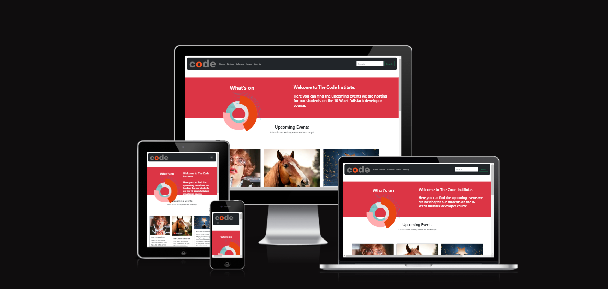
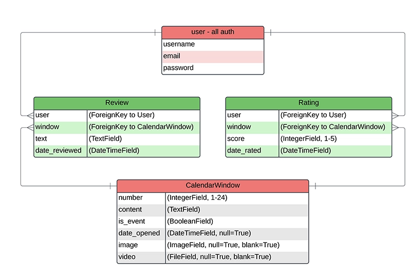
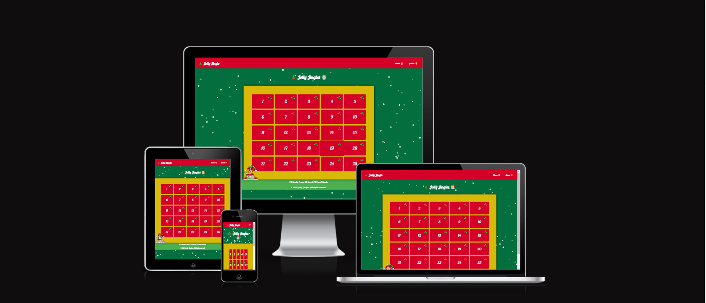
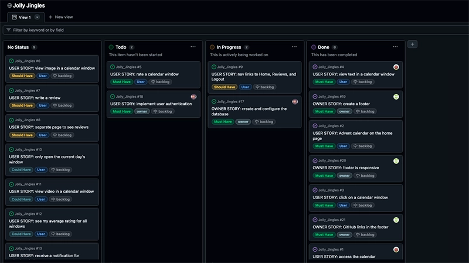
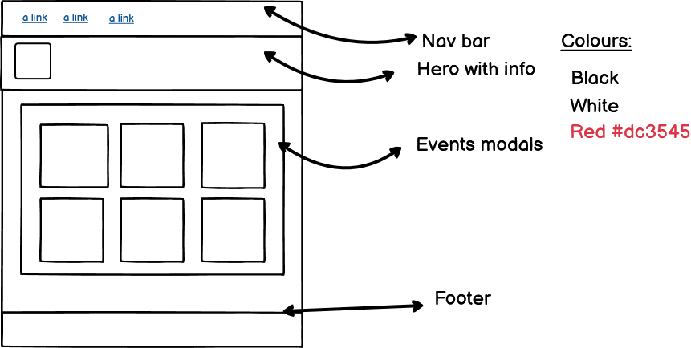
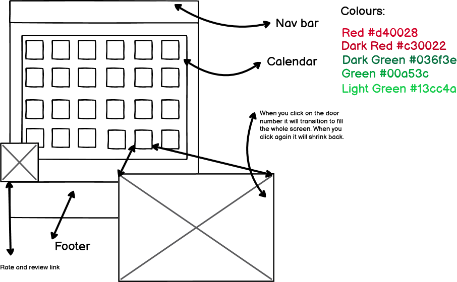
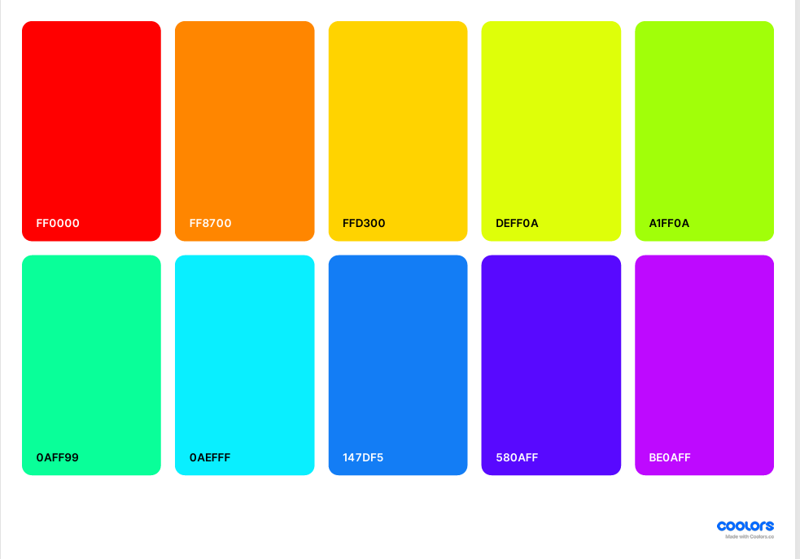
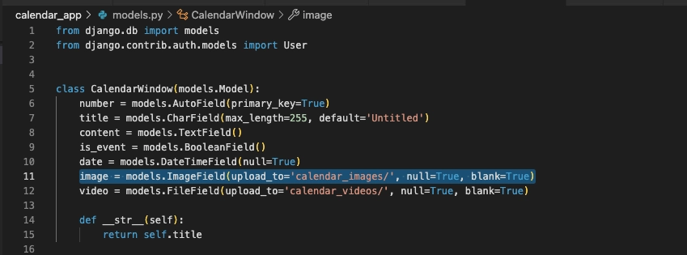
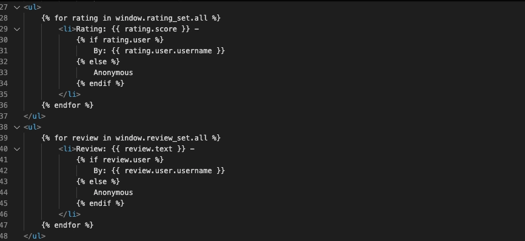

# Jolly Jingle

  

# Jolly Jingle

## View the Live Project
You can view the live project [here][live-project].

[live-project]: https://hackathon-2-jolly-jingle-26c4f6467fd3.herokuapp.com/

The website is intended to celebrate everyone's unique personalities on the course who has made it to the end. We have created an advent calendar to award each person with a humourous or whimsical achievement that has been voted for my their coworkers.

# Table of Contents
- [Project Description](#project-description)
- [User Experience](#user-experience) 
- [User Stories](#must-have)
- [MoSCoW Prioritization](#moscow-prioritization)
- [Design and Wireframes](#design)
- [Website Features](#website-features)
- [Technologies Used](#technologies-used)
- [Deployment](#deployment)
- [Creation Process](#creation-process)
- [Future Features](#future-features-)
- [Credits](#credits)

# Project Description

As a team we wanted the final Hackathon to be amusing for our co students. Martin thought it was a lovely idea to make a website that would humorously dedicate each "door" of the advent calendar to each member of the Lancashire team. Each door will have a lighthearted question, for example; "Who was the most chilled out?" or "Most likely to blame a pet on something?". We sent out questionnaires to our cohorts so they could vote on who they thought was the most deserving of the title. There are 25 questions and each member of the team will be assigned a door. When the "door" is opened the question will be asked and you can decide if you wish to find out or not. If you wish to know there will be a fullscreen celebratory "fireworks display" with the person who has won. Clicking anywhere on the screen will return you to the calendar and you may choose a new number. Once a "door" has been opened there will be a change of colour to green to indicate that the "door" has already been accessed.
We have kept this as a static file using HTML, CSS and JavaScript.
We felt that we could make the homepage a very dull and boring calendar and within this there will be a link to the real website. We have done this because as a group I think we are very strong and have produced some amazing work both individually and in other teams. The shock of discovering we have created something that is as basic as possible we hope will hoodwink the teams into being a little disappointed and then we can surprise them with our real intention of the project. This is a static HTML, CSS and JavaScript page.
Our CRUD portion of the project will be the ability to rate and review our website with a rating and comments section once they have logged in. This will be done in Django.

# Jolly Jingles Project

 ## USER EXPERIENCE
 ---
**Database Planning**

I used [LucidChart](https://lucid.app/documents#/home?folder_id=recent) to create my ERD for my database. It is a simple model with only four models: User, Review, Rating and Calendar.
The User model was imported from Django Allauth

**Purpose and Intended Audience**

The website is intended to celebrate everyone's unique personalities on the course who have made it to the end. We have created an advent calendar to award each person with a humourous or whimsical achievement that has been voted for by their coworkers. There is a rate and review element in order to satisfy the Django portion of the project.

**User stories**
     
# MoSCoW Prioritization Table

| **Priority** | **Feature**                                                                                           | **Acceptance Criteria (AC)**                                                                                                                                                                    |
|--------------|-------------------------------------------------------------------------------------------------------|-----------------------------------------------------------------------------------------------------------------------------------------------------------|
| **Must Have**| Users must see a 25-day Advent calendar on the homepage.                                              | - AC1: Calendar must be responsive and adapt to mobile and desktop screens.                                                                               |
|              |                                                                                                       | - AC2: Each window should have a number from 1-25.                                                                                                       |
|              |                                                                                                       | - AC3: Unopened windows should have a consistent, festive colour design.                                                                                 |
|              | Users must be able to view text content in a calendar window.                                         | - AC1: Each window must be clickable.                                                                                                                    |
|              |                                                                                                       | - AC2: Text should be legible with appropriate font and sizing.                                                                                          |
|              |                                                                                                       | - AC3: Buttons must be clear.                                                                                                                            |
|              | Users must be able to click a calendar window to view its content.                                    | - AC1: Each window must be clickable.                                                                                                                    |
|              |                                                                                                       | - AC2: Clicking a window opens a modal or expands to show content.                                                                                       |
|              |                                                                                                       | - AC3: The window will ask a question, and the user decides if they wish to proceed.                                                                      |
|              | Users should only open current or past windows.                                                       | - AC1: Future windows should be visually distinct and non-clickable.                                                                                     |
|              |                                                                                                       | - AC2: Attempting to open a future window should display a message indicating it's not yet available.                                                    |
|              | Users must be able to view image content in a calendar window.                                        | - AC1: The image should be displayed with appropriate sizing and aspect ratio.                                                                            |
|              |                                                                                                       | - AC2: If the image fails to load, a placeholder or error message should be shown.                                                                        |
|              | Users must be able to rate a calendar window (1-5 stars).                                             | - AC1: Rating system must allow selection from 1-5 stars.                                                                                                |
|              |                                                                                                       | - AC2: Review must allow for a text box to display content.                                                                                              |
|              | Users must be able to write a review for the calendar.                                                | - AC1: A text area for writing a review should be available.                                                                                             |
|              |                                                                                                       | - AC2: The review should be saved and associated with both the user and the calendar.                                                                    |
|              | Users must be able to view video content in a calendar window.                                        | - AC1: Videos should play within the opened window without external plugins.                                                                              |
|              |                                                                                                       | - AC2: Video playback controls (play, pause, volume) should be available.                                                                                |
|              | Users should be able to navigate to a "Reviews" page.                                                 | - AC1: A "Reviews" page should display all reviews written.                                                                                              |
|              |                                                                                                       | - AC2: Each review on this page should show the associated date of review.                                                                               |
|              | Footer must include GitHub account links.                                                             | - AC1: The footer should be displayed consistently across all pages.                                                                                     |
|              |                                                                                                       | - AC2: The footer should include clickable links to the GitHub accounts of relevant team members.                                                        |
|              | User authentication must be implemented using Django.                                                 | - AC1: Users should be able to register, log in, and log out.                                                                                            |
|              |                                                                                                       | - AC2: Authentication should be required to access the calendar features.                                                                                |
|              | Database must be set up using Django ORM.                                                             | - AC1: Migrations must be created for all models.                                                                                                        |
|              |                                                                                                       | - AC2: The database should handle foreign key relationships correctly.                                                                                   |
|              | Notifications should inform users of new window availability.                                         | - AC1: Notification appears on login when a new window is available.                                                                                     |
|              |                                                                                                       | - AC2: Notification should indicate which window is available.                                                                                           |

| **Should Have** | Footer should be responsive.                                                                        | - AC1: Footer adapts to mobile and desktop screens.                                                                                                       |
|                 |                                                                                                     | - AC2: Footer matches the application's theme with appropriate colours and fonts.                                                                         |
|                 | Users should see their average rating for all rated windows.                                       | - AC1: Average rating is displayed on user profile or dashboard.                                                                                         |
|                 |                                                                                                     | - AC2: Average rating updates in real-time.                                                                                                              |

| **Could Have** | Users should be able to create or edit calendar window content.                                     | - Feature available for advanced user content management.                                                                                                |

| **Won’t Have** | Integration with external calendar APIs or plugins.                                                | - This feature is not planned for the current project.                                                                                                   |
|                 | Multi-language support for calendar content.                                                      | - This feature is out of scope for now.                                                                                                                  |
|                 | Advanced analytics or reporting for user interactions.                                            | - Deferred to future releases.                                                                                                                           |

 
# Advent Calendar Project

## MoSCoW Prioritization

project board:

### **Must Have**
These features are essential for the project to function correctly:

1. **Calendar Features**
   - Users must see a visual representation of the 25-day Advent calendar on the homepage.
     - AC1: Calendar must be responsive and adapt to mobile and desktop screens.
     - AC2: Each window should have a number from 1-25.
     - AC3: Unopened windows should have a consistent, festive colour design.
   - Users must be able to view text content in a calendar window.
     - AC1: Each window must be clickable.
     - AC2: Text should be legible with appropriate font and sizing.
     - AC3: Buttons must be clear.
   - Users must be able to click on a calendar window to view its content.
     - AC1: Each window must be clickable.
     - AC2: Clicking a window opens a modal or expands to show content.
     - AC3: The window will ask a question, and the user decides if they wish to proceed.
   - Users should only open the current day's window or windows from previous days.
     - AC1: Windows with future dates should be visually distinct and non-clickable.
     - AC2: Attempting to open a future window should display a message indicating it's not yet available.
   - Users must be able to view image content in a calendar window.
     - AC1: The image should be displayed within the opened window with appropriate sizing and aspect ratio.
     - AC2: If the image fails to load, a placeholder or error message should be shown.
   - Users must be able to rate a calendar window on a scale of 1-5.
     - AC1: Rating system must allow selection from 1-5 stars.
     - AC2: Review must allow for a text box to display content.
   - Users must be able to write a review for the calendar.
     - AC1: A text area for writing a review should be available.
     - AC2: The review should be saved and associated with both the user and the calendar.
   - Users must be able to view video content in a calendar window.
     - AC1: Videos should play within the opened window without requiring external plugins.
     - AC2: Video playback controls (play, pause, volume) should be available to the user.
   - Users should be able to navigate to a separate page to view all the reviews.
     - AC1: A "Reviews" page should display all reviews written.
     - AC2: Each review on this page should show the associated date of review.

2. **Footer**
   - The footer must include links to GitHub accounts.
     - AC1: The footer should be consistently displayed across all pages of the application.
     - AC2: The footer should include clickable links to the GitHub accounts of all relevant team members.

3. **User Authentication**
   - Users must be able to register, log in, and log out using Django's built-in User model or AllAuth.
     - AC1: User authentication should be required to access the calendar and its features.

4. **Database**
   - The database must be set up using Django's ORM.
     - AC1: Handle relationships between models correctly, including foreign key relationships.

5. **Notifications**
   - Users must receive a notification when a new window becomes available.
     - AC1: A notification should appear on the site when the user logs in on a new day.
     - AC2: The notification should indicate which new window is available to open.

### **Should Have**
These features are important but not critical for the minimum viable product:

1. **Footer Responsiveness**
   - The footer should adapt to different screen sizes.
     - AC1: Maintain usability on mobile and desktop devices.
     - AC2: Match the overall theme of the application, including appropriate colours and fonts.

2. **Average Rating**
   - Users should see their average rating for all windows they have rated.
     - AC1: Display the average rating on the user's profile or dashboard.
     - AC2: Update the average rating in real-time when a new rating is submitted.

### **Could Have**
These features are desirable but not necessary for the initial release:

1. **User Content Management**
   - Users should be able to create or edit calendar window content.

### **Won’t Have (for now)**
These features are out of scope for the current project but may be revisited in the future:

1. Integration with external calendar APIs or plugins.
2. Multi-language support for calendar content.
3. Advanced analytics or reporting for user interactions.

## CREATION PROCESS

  ### Wireframes
  We created two wireframes to give us an understanding of the fonts and colours we would be using for the project. This gives a general overview of the layout of the webpages.

  
  

 

## DESIGN
  - **Typography**
   
    [Google Fonts](https://fonts.google.com/) was used to choose the font used. I had the idea that I wanted a bold typeface that was readable on all devices, but was festive for the theming of our website.
   
    The Poppin font was chosen for the Events page as this was considered corporate which was the look we were going with. It was also a clear typeface that helped with contrast and readability.

The Lobster font was used for the advent calendar portion of the website as it had a festive theme and was bold enough and with good contrast.
   
  - **Colour scheme**
   
  

       
The colour scheme for the events page was red, black and white this was so it was easy to navigate and read.

The colours chosen for the advent part of the website were in keeping with the festive theme we were looking for. The use of reds and greens are a traditional combination with a smattering of gold thrown in for good measure.
   
  - **Imagery**
   
We wanted to have corporate imagery for the events pages as to confound our co students into thinking we had made a boring website and then surprise them with the fun advent calendar that nominates and awards a winner based on the views of the whole Lancashire group.
 

 ---

## WEBSITE FEATURES

  **MAIN VIEW**
 
  **RATING/REVIEW FEATURE**

The ability to rate and review an event. You have to login to make an event. User can find out times and dates for future events

  **SOCIAL LINKS FEATURE**

  The footer gives links to GitHub. The colour was chosen to match the festive theme and fit in with the overall colour scheme.

## FUTURE FEATURES ?????

- Validation for some of the code due to time restraints - it's fully functioning but not adjusted to accessibility etc.
- The ability to change the Advent for different holidays and seasons?
- CRUD ratings and review
- User feedback
- add abilty to resize images so they fit equally

## TECHNOLOGIES USED

  ### Languages used
  - HTML5

  - CSS

  - JavaScript

  - Python
   - asgiref==3.8.1
   - cloudinary==1.41.0
   - dj-database-url==0.5.0
   - gunicorn==20.1.0
   - oauthlib==3.2.2
   - psycopg==3.2.1
   - PyJWT==2.9.0
   - python3-openid==3.2.0
   - requests-oauthlib==2.0.0
   - sqlparse==0.5.1
   - urllib3==1.26.19
   - whitenoise==5.3.0
     

  - Django
    - summernote==0.8.20.0
    - allauth==0.57.2
    - crispy-forms==2.3

  ### Frameworks, libraries and programs used

   
  1. [Bootstrap 4.6](https://getbootstrap.com/docs/4.6/getting-started/introduction/)
        - Bootstrap was used to ensure the site was responsive and for styling - we also used 5 for the main site
  2. [Balsamiq](https://balsamiq.com/wireframes/)  
        - Balsamiq was used to produce the wireframes in the design phase.
  3. [Git](https://git-scm.com/)
        - Git was used for version control
  4. [Github](https://github.com/)
        - GitHub was used to store the code and allow collaboration on the project.
  5. [Contrast Finder](https://app.contrast-finder.org/?lang=en)
        - Contrast Finder was used to check the contrast between text colour and background image
  6. [Tiny.PNG](https://tinypng.com/)
        - Tiny.PNG was used to compress images
  7. [StackEdit](https://stackedit.io/)
        - StackEdit was used to assist with the markdown in the README.md
  8. [Google Chrome Dev Tools](https://developer.chrome.com/docs/devtools)
        - Used to troubleshoot and test design ideas and styling.  
  9.  [Google Lighthouse](https://developer.chrome.com/docs/lighthouse/overview)  
        - used to test performance of the website
  10. [Favicon](https://favicon.io/)
        - used to generate the favicon  
  11. [W3 Schools](https://www.w3schools.com/)
        - used to look up syntax for HTML and CSS
  12. [Stack Overflow](https://stackoverflow.com/)                  
        - used for queries around coding
  13. [Perplexity](https://www.perplexity.ai/)    
        - for bug fixes and errors.
  14. [Font Awesome](https://fontawesome.com/)    
        - used for the favicon
  15. [W3C HTML validator](https://validator.w3.org/)
        - used to validate the HTML
  16. [JSHint](https://jshint.com/)
        - used to validate the JavaScrip
  17. [Python Enhancement Proposals](https://peps.python.org/pep-0008/)
        - for advice on PEP8 compliance    
  18. [CI Python Linter](https://pep8ci.herokuapp.com/) - for validating Python code
  19. [Heroku](https://dashboard.heroku.com/apps)

 ---

## DEPLOYMENT
The site was deployed to Heroku. The steps to deploy are as follows:
 - Install the gunicorn python package and create a file called 'Procfile' in the repo's root directory
 - In the Procfile write 'web: gunicorn lunar_lists.wsgi'
 - In settings.py add ".herokuapp.com" to the ALLOWED_HOSTS list
 - In settings.py add 'https://*.herokuapp.com' to CSRF_TRUSTED_ORIGINS list, git add, commit and push to github

Navigate to the Heroku dashboard
 - Create a new Heroku app
 - Give it a name and select the region 'Europe'
Navigate to settings tab and scroll down to Config Vars
 - Click 'Reveal Config Vars'
 - Add the following keys:
         key = DATABASE_URL | value = (my secret database url)
         key = SECRET_KEY | value = (my secret key)
Navigate to Deploy tab
 - Connect to GitHub and select the repo 'lunar-lists'
 - Scroll down to 'Manual deploy' and select the 'main' branch
 - Click 'Deploy Branch'
   

 ---

## TESTING

  ### HTML validation

*These are future features as we ran out of time.

I have used the W3C Markup validator to validate all of my HTML code - [W3C Markup Validator](https://validator.w3.org/)

Static pages validated with W3 School validator One error which was ignored as it was implemented in the javascript.

   ### CSS validation

CSS validated in W3 schools, no errors.

   ### Javascript validation

JavaScript tested in JSHint no errors.

   ### Python validation
[CI Python Linter](https://pep8ci.herokuapp.com/#) was used to validate the python files I created or edited myself.
Initial errors were thrown up involving line length of comments and spacing but these were corrected.    

*These are future features as we ran out of time.
 

## Lighthouse scores via Chrome dev tools

Excellent performance ratings.

### Issues/Bugs
  
No issues with Advent calendar HTML, CSS or Javascript. 

Three main problems with Django:

1. Issue with Cloudinary not pulling images through to Heroku.

This was due to inital set up. Having put the field for the model as a local storage and not for cloudinary. it took awhile to figure out what the issue was, as there are a lot of moving parts. Ulitmately it required the cloudinary storage being added to the model, and the Import of cloudinary too:

2. The ratings and review to show with one button that would add the ratings and review to the event. Had to change the way the forms and views were set up and went around in a circle for awhile. The button became misaligned with the event page and had various smaller issues that came after solving this. The solution was to look at the way the viws implemented the form. The button had an issue and conflict with edit_event and create_event templates.

3. The date and title appearing as duplicates. 

The difficulty arose from the date field now showing with a pop out calendar to pick. As it was a form for just adding numbers the date would not recognise. However everytime I added the Date and Time for this due to the 'forms' it would add it as 2 separate forms in the create event. The solution was to change the views for CalendarWindow and Edit. Also look at the way the template was displaying the fields and how to make sure the 'forms' that came through were used or ignored.

### Agile Process
We made an attempt to follow an agile process. We had a project board in github which we updated with my user stories. Each user story was labelled according to MoSCoW prioritisation and had acceptance criteria. 

## CREDITS

**Content**
Chat GPT
Me (Sarah Moorby)
Microsoft AI Image generator
https://www.remove.bg/
Tiny.PNG
  

**Acknowledgements**
  - Amy Richardson (Facilitator with Code Institute) - For providing support and resources and tirelessly encouraging
  - Mark Briscoe (SME with Code Institute) - For providing technical knowledge and support with coding and GitHub/GitPod and being constantly 
    encouraging and positive
  - John Rearden (Coding coach with Code Institute) - for amazing coding expertise and calm advice
  - Ruairidh MacArthur (Coding coach with Code Institute) - for amazing coding expertise and calm advice
  - I’d like to thank the academy !!
